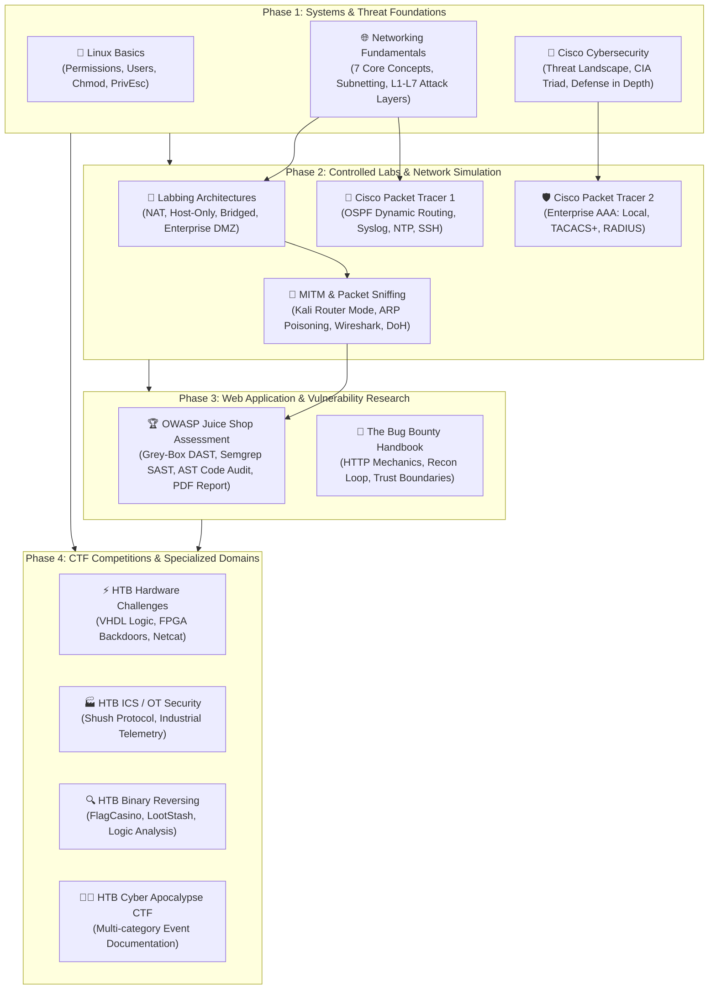
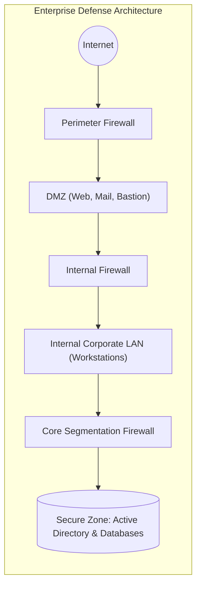
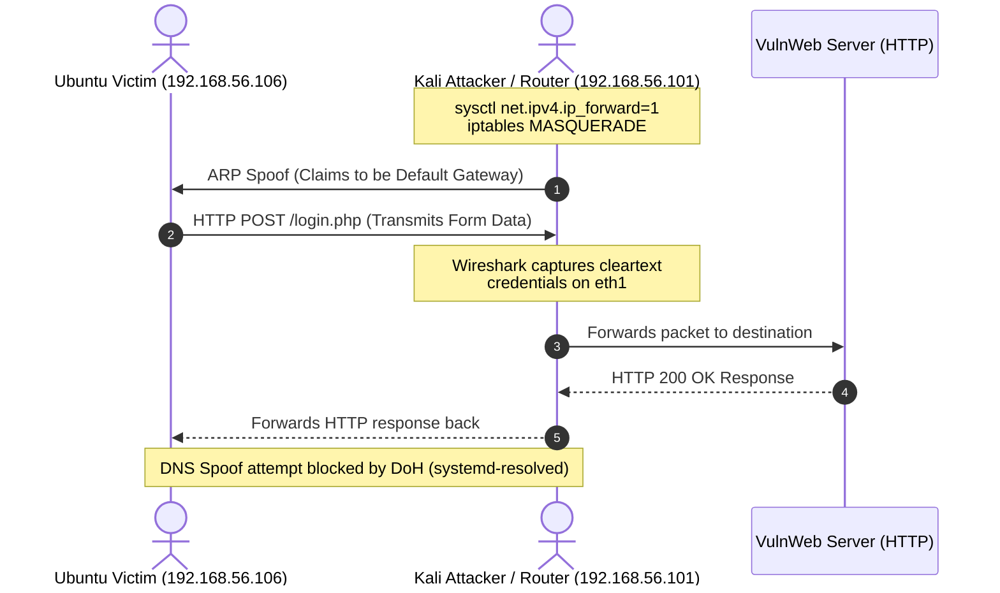
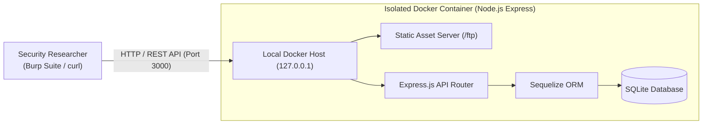
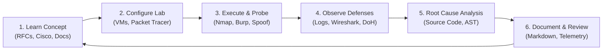

# 🛡️ Cybersecurity Learning

> A structured, evidence-backed cybersecurity learning repository and technical lab notebook covering Linux internals, computer networking, threat analysis, practical MITM & enterprise routing labs, web application security assessments, and CTF research.

[](./LICENSE)
[](./networking-fundamentals/7CORENetworkingNotes.md)
[](./Practicals/)
[](./projects/owasp-juice-shop-security-assessment/)
[](./CTF/HackTheBox/)

---

## 📌 Navigation

[What Is This Repository?](#what-is-this-repository) • [Quick Navigation](#quick-navigation) • [Learning Architecture](#learning-architecture) • [Repository Structure](#repository-structure) • [Linux Basics](#linux-basics) • [Networking Fundamentals](#networking-fundamentals) • [Security Fundamentals & Cisco Curriculum](#security-fundamentals--cisco-curriculum) • [Practicals & Hands-On Labs](#practicals--hands-on-labs) • [Featured Project: OWASP Juice Shop](#featured-project-owasp-juice-shop-security-assessment) • [CTF & Hardware/ICS Research](#ctf--specialized-security-research) • [Bug Bounty Handbook](#the-bug-bounty-handbook) • [Tools & Technologies](#tools--technologies) • [Methodology & Philosophy](#learning-methodology--documentation-philosophy) • [Progress Status](#repository-progress--status) • [How to Use](#how-to-use-this-repository) • [Disclaimer](#responsible-security-disclaimer) • [About the Author](#about-the-author)

---

## 📖 What Is This Repository?

This repository documents my structured learning journey in **Cybersecurity and Systems/Network Security** as a **B.Sc. Information Technology** student. 

Rather than compiling generic theoretical summaries or collecting passive completion certificates, this repository serves as a **living, reproducible technical lab notebook and engineering portfolio**. It captures the complete lifecycle of cybersecurity training:

- **WHO**: An aspiring cybersecurity researcher and security engineer building deep, first-principles understanding from systems fundamentals to modern web and network exploitation.
- **WHAT**: A comprehensive collection of technical notes, controlled virtual machine labs, Cisco Packet Tracer enterprise configurations, web application security assessments with source-code root cause analysis, CTF competition writeups (hardware, ICS, and reversing), and methodological handbooks.
- **WHY**: True security competence is demonstrated through verification—capturing packets in Wireshark, dissecting routing protocols, identifying AST/code-level root causes, and observing real defensive controls (such as DoH thwarting DNS spoofing).
- **HOW**: **Learn Concept → Configure Controlled Lab → Execute & Observe → Analyze Defensive Failures → Document Telemetry → Synthesize Lessons**.

---

## ⚡ Quick Navigation

| Domain / Area | Core Focus | Key Repository Artifacts | Status |
|---|---|---|---|
| [🐧 **Linux Basics**](#linux-basics) | File permissions, user groups, privilege escalation vectors | [`linux-basics/file-permissions.md`](./linux-basics/file-permissions.md) | 🟢 Active |
| [🌐 **Networking Fundamentals**](#networking-fundamentals) | 7 Core Concepts (TCP/IP, ARP, DNS, Subnetting, VLANs, Firewalls) & Labbing Topologies | [`networking-fundamentals/7CORENetworkingNotes.md`](./networking-fundamentals/7CORENetworkingNotes.md)<br>[`networking-fundamentals/network-labbing-notes/LABBING-NOTES.md`](./networking-fundamentals/network-labbing-notes/LABBING-NOTES.md) | 🟢 Active |
| [🔐 **Security Fundamentals**](#security-fundamentals--cisco-curriculum) | Cisco Networking Academy complete curriculum (CIA triad, malware, APTs, IDS/IPS, NetFlow) | [`IntroductiontoCybersecurity(CISCO).md`](./IntroductiontoCybersecurity%28CISCO%29.md) | 🟢 Comprehensive |
| [🧪 **Hands-On Practicals**](#practicals--hands-on-labs) | MITM ARP/DNS spoofing, Cisco enterprise routing, Syslog, NTP, and AAA (TACACS+/RADIUS) | [`Practicals/Practical-1-MITM-ARP-Sniffing-DNS-Spoofing.md`](./Practicals/Practical-1-MITM-ARP-Sniffing-DNS-Spoofing.md)<br>[`Practicals/Cisco-Networking/`](./Practicals/Cisco-Networking/) | 🟢 Documented |
| [🏆 **Featured Project**](#featured-project-owasp-juice-shop-security-assessment) | OWASP Juice Shop web security assessment: DAST + Semgrep SAST + AST code review + PDF report | [`projects/owasp-juice-shop-security-assessment/README.md`](./projects/owasp-juice-shop-security-assessment/README.md)<br>[`Full PDF Report`](./projects/owasp-juice-shop-security-assessment/report/Web_sec_rp.pdf) | 🟢 Completed Report |
| [🏴‍☠️ **CTF & Specialized Research**](#ctf--specialized-security-research) | Hack The Box challenges: VHDL hardware logic, ICS/SCADA Modbus protocols, binary reversing | [`CTF/HackTheBox/`](./CTF/HackTheBox/) | 🟢 Writeups Included |
| [📖 **Bug Bounty Handbook**](#the-bug-bounty-handbook) | Personal working draft on web security research, reconnaissance loops, and reporting | [`BugBounty/README.md`](./BugBounty/README.md) | 🟡 Working Draft |
| [🧩 **TryHackMe Writeups**](#tryhackme--hands-on-platforms) | Hands-on platform room notes and laboratory walk-throughs | [`tryhackme-writeups/`](./tryhackme-writeups/) | 🛠️ Staged |

---

## 🗺️ Learning Architecture

The roadmap below illustrates how the learning domains in this repository interconnect—moving from foundational operating system and networking primitives to controlled network simulation, dynamic application security testing, and competitive security research:



---

## 🗂️ Repository Structure

The directory hierarchy reflects the actual contents and modular organization of this repository:

```text
cybersecurity-learning/
├── IntroductiontoCybersecurity(CISCO).md    # Complete 5-module Cisco Cybersecurity Academy notes
├── LICENSE                                  # MIT License (Aryan Singh)
├── README.md                                # Repository front-door and architecture guide
├── BugBounty/                               # Web security research and methodology
│   └── README.md                            # Comprehensive Bug Bounty Handbook (2,300+ lines)
├── CTF/                                     # Capture The Flag writeups and challenge solutions
│   └── HackTheBox/
│       ├── CTF Try Out/
│       │   ├── Hardware/                    # Hardware security & HDL challenges
│       │   │   ├── 01-Its-Oops-PM/          # VHDL logic, FPGA backdoor analysis
│       │   │   ├── 02-Critical-Flight/      # Hardware signal and Gerber analysis
│       │   │   └── 03-Debug/                # UART / logic debugging
│       │   ├── ICS/                         # Industrial Control Systems
│       │   │   └── Shush Protocol/          # OT / SCADA protocol analysis
│       │   └── Reversing/                   # Binary reverse engineering
│       │       ├── Don't Panic!/            # Binary inspection & decompilation
│       │       ├── FlagCasino/              # Logic disassembly and analysis
│       │       └── LootStash/               # Strings and static binary extraction
│       └── Cyber Apocalypse CTF 2026_ The Salt Crown/
│           └── README.md                    # Event overview, narrative, and solve notes
├── linux-basics/                            # Linux operating system fundamentals
│   ├── README.md                            # Domain introduction
│   └── file-permissions.md                  # Permissions, octal masks, privilege escalation
├── networking-fundamentals/                 # Network protocols and architecture
│   ├── README.md                            # Section overview
│   ├── 7CORENetworkingNotes.md              # 7 Core Networking Concepts for Ethical Hackers
│   └── network-labbing-notes/
│       └── LABBING-NOTES.md                 # Home lab vs enterprise network topologies
├── Practicals/                              # Hands-on lab documentation and configurations
│   ├── Practical-1-MITM-ARP-Sniffing-DNS-Spoofing.md # End-to-end MITM & DoH analysis lab
│   └── Cisco-Networking/                   # Cisco Packet Tracer network security labs
│       ├── README.md                        # Cisco practical overview
│       ├── Practical-1-Syslog-NTP-SSH/      # Secure router management lab
│       │   ├── Practical-1-Writeup.md       # Configuration steps & verification
│       │   └── Practical-1-Notes.pdf        # Lab diagram and reference document
│       └── Practical-2-AAA-TACACS-RADIUS/   # Identity and access control lab
│           ├── Practical-2-Writeup.md       # AAA architecture & authentication walkthrough
│           └── Practical-2-Notes.pdf        # Protocol notes and reference document
├── projects/                                # Flagship technical security projects
│   └── owasp-juice-shop-security-assessment/
│       ├── README.md                        # Executive summary, findings, and remediation
│       ├── scope.md                         # Rules of engagement and target constraints
│       ├── recon.md                         # Port enumeration and surface mapping
│       ├── evidence/                        # Sanitized HTTP transcripts and command logs
│       ├── scans/                           # Nmap scans and Semgrep static analysis results
│       └── report/
│           └── Web_sec_rp.pdf               # Formal 15-page technical security report
├── security-fundamentals/                   # General security concepts (staged)
│   └── README.md
└── tryhackme-writeups/                      # TryHackMe lab walkthroughs (staged)
    └── README.md
```

### Detailed Area Breakdown

| Directory | Primary Content | Verified Skills & Technologies |
|---|---|---|
| [`linux-basics/`](./linux-basics/) | File permissions, user and group ownership, access control | `chmod`, `chown`, `ls -l`, SUID concept, privilege escalation awareness |
| [`networking-fundamentals/`](./networking-fundamentals/) | IP addressing, subnetting, ARP, DNS, critical ports, OSI/TCP-IP attack mapping, switching/routing, VLAN hopping, firewalls, and lab network topologies | Subnet calculation, CIDR, ARP cache poisoning, DNS query flow, Wireshark inspection, VirtualBox/VMware networking modes |
| [`IntroductiontoCybersecurity(CISCO).md`](./IntroductiontoCybersecurity%28CISCO%29.md) | Cisco Networking Academy 5-module comprehensive curriculum | CIA triad, malware taxonomy, social engineering, credential stuffing, botnets, APTs, firewalls, IDS/IPS, NetFlow, incident response lifecycle |
| [`Practicals/`](./Practicals/) | Live MITM on Linux VMs; Cisco Packet Tracer enterprise configurations | Packet forwarding (`sysctl`), NAT masquerade (`iptables`), `arpspoof`, `dnsspoof`, Wireshark POST capture, DoH defense analysis, OSPF, Syslog, NTP, SSH, AAA, TACACS+, RADIUS |
| [`projects/owasp-juice-shop-security-assessment/`](./projects/owasp-juice-shop-security-assessment/) | Formal security assessment of OWASP Juice Shop v16.0.0 on isolated Docker | OWASP WSTG v4.2, DAST, Burp Suite, Nmap, Semgrep SAST, Node.js/Express AST code review, CVSS scoring, formal PDF reporting |
| [`CTF/HackTheBox/`](./CTF/HackTheBox/) | Hardware VHDL analysis, ICS protocol inspection, binary reversing | VHDL hardware logic, FPGA backdoor analysis, Netcat socket interaction, SCADA/Modbus, binary decompilation |
| [`BugBounty/`](./BugBounty/) | In-depth 2,300+ line web security handbook and research methodology | HTTP protocol internals, attack surface mapping, trust boundary analysis, parameter tampering, professional disclosure standards |
| [`tryhackme-writeups/`](./tryhackme-writeups/) | Hands-on platform room notes and laboratory walk-throughs | Room analysis, offensive/defensive tooling, active learning lab notebook |

---

## 🐧 Linux Basics

Linux constitutes the foundational operating system for penetration testing, security auditing, and server infrastructure. The repository covers fundamental system security mechanisms:

- **Permissions Model**: Read (`r` / 4), Write (`w` / 2), and Execute (`x` / 1) permissions across User (`u`), Group (`g`), and Others (`o`).
- **Administrative Utilities**: `ls -l` for directory inspection, `chmod` for octal and symbolic permission manipulation, and `chown` for ownership management.
- **Cybersecurity Context**: Incorrect permission configurations (such as world-writable files, overly permissive scripts, or unintended SUID/SGID bits) provide direct privilege escalation vectors for local attackers.

🔗 **Resource**: [Linux File Permissions Guide](./linux-basics/file-permissions.md)

---

## 🌐 Networking Fundamentals

A deep comprehension of computer networks is essential for ethical hacking and defensive engineering. The repository documents networking through the **7 Core Concepts for Ethical Hackers** alongside practical lab architectures:

### 1. The 7 Core Concepts

```text
Layer 7 (Application)   ──► SQLi, XSS, Auth Bypass, HTTP APIs
Layer 4 (Transport)     ──► SYN Floods, Port Scanning (TCP Stateful vs UDP Stateless)
Layer 3 (Network)       ──► IP Addressing, CIDR Subnetting, Routing Table Manipulation
Layer 2 (Data Link)     ──► MAC Spoofing, ARP Poisoning (MITM), VLAN Hopping
Layer 1 (Physical)      ──► Physical Interception, Port Security
```

1. **IP Addressing & Subnetting (Target Scoping)**:
   - Difference between public exposure (external attack surface) and private addresses (internal lateral movement).
   - Practical CIDR calculation: Subnet size dictates host density, scan ranges, and bug bounty target boundaries.
2. **MAC Address, ARP & MITM (Trust Breakdown)**:
   - Layer 2 hardware addressing and the inherent design flaw of Address Resolution Protocol (ARP): unsolicited responses are accepted without cryptographic validation.
   - Dynamic ARP Inspection (DAI) and static bindings as counter-mechanisms.
3. **DNS & Domain Spoofing**:
   - The recursive resolution chain (`Client → Resolver → Root → TLD → Authoritative → Cache`).
   - Vulnerabilities in unencrypted DNS: cache poisoning and localized spoofing, and why domain trust failure undermines higher-level application safety.
4. **Ports & Critical Protocols**:
   - Service mapping: Port 21 (FTP), Port 22 (SSH), Port 80/443 (HTTP/HTTPS), Port 445 (SMB), Port 3389 (RDP).
   - TCP (reliable, stateful 3-way handshake, heavily logged) vs. UDP (fast, connectionless, often reveals unmonitored perimeter services).
5. **OSI & TCP/IP Attack Mapping**:
   - Attackers view the OSI model as an actionable taxonomy of weakness at each protocol layer rather than theoretical abstraction.
6. **Routing, Switching & VLAN Security**:
   - Switching tables and MAC exhaustion/flooding.
   - Trunk port misconfiguration leading to VLAN hopping and bypassing network segmentation.
7. **Firewalls, NAT & Evasion Reality**:
   - Packet filtering vs. application inspection; NAT as address translation rather than a security boundary.
   - Evasion techniques: port multiplexing over 80/443, DNS tunneling, outbound-only C2 beacons.

🔗 **Resource**: [7 Core Networking Notes for Ethical Hackers](./networking-fundamentals/7CORENetworkingNotes.md)

### 2. Network Labbing Architectures (Home vs. Enterprise)

The labbing guide breaks down hypervisor networking modes and enterprise zone segmentation:

| Virtual Network Mode | Internet Access | Host ↔ VM | VM ↔ VM | Practical Use Case |
|---|:---:|:---:|:---:|---|
| **Host-Only** | ❌ No | ✅ Yes | ✅ Yes | Safe, completely isolated attack/defense testing |
| **Internal Network** | ❌ No | ❌ No | ✅ Yes | Kali Linux vs. vulnerable victim VM (zero host exposure) |
| **NAT** | ✅ Yes | ❌ No | ❌ No | Isolated internet access for package updates |
| **NAT Network** | ✅ Yes | ❌ No | ✅ Yes | Multi-VM testing requiring external connectivity |
| **Bridged** | ✅ Yes | ✅ Yes | ✅ Yes | Joins host LAN; required for local MITM and ARP labs |
| **Not Attached** | ❌ No | ❌ No | ❌ No | Safe quarantine for malware analysis |



🔗 **Resource**: [Labbing Notes — Home & Enterprise Environments](./networking-fundamentals/network-labbing-notes/LABBING-NOTES.md)

---

## 🔐 Security Fundamentals & Cisco Curriculum

The repository contains extensive, structured notes based on the **Cisco Networking Academy: Introduction to Cybersecurity** curriculum, organized into five core modules:

<details>
<summary><b>Click to expand Module-by-Module Cisco Breakdown</b></summary>

### Module 1: The World of Cybersecurity
- **The CIA Triad**: Confidentiality (authorized access), Integrity (data fidelity), and Availability (uninterrupted service).
- **Data & Digital Assets**: Data value exceeding physical hardware; credentials, databases, source code, and telemetry as prime targets.
- **Smart Devices & IoT**: Proliferation of embedded hardware with default credentials, unpatched firmware, and botnet recruiting risks.
- **Hacker Motivation**: Financial fraud, ransomware, corporate espionage, ideological motivation, and covert persistence.

### Module 2: Attacks, Concepts, and Techniques
- **Malware Taxonomy**: Viruses, worms, trojans, ransomware, and spyware; delivery vectors dominated by user interaction.
- **Social Engineering**: Psychological exploitation via urgency, authority, fear, and curiosity.
- **Credential Attacks**: Brute force, dictionary attacks, and credential stuffing exploiting cross-service password reuse.
- **On-Path / MITM Attacks**: Interception of communication channels across unencrypted Wi-Fi and spoofed networks.
- **DoS, DDoS & Botnets**: Volumetric and application-layer exhaustion attacks compromising service availability.
- **Advanced Persistent Threats (APTs)**: Highly resourced, state-sponsored actors focused on silent, multi-year operational persistence.

### Module 3: Protecting Data and Privacy
- **Endpoint Hardening**: Patch management, host firewalls, least privilege enforcement, and endpoint protection.
- **Wireless & Network Security**: WPA2/WPA3 encryption, default router configuration hardening, WPS deprecation.
- **Identity & Authentication**: Multi-Factor Authentication (MFA/2FA) hierarchy (SMS vs. Authenticator Apps vs. Hardware FIDO2 keys) and OAuth delegated authorization tokens.
- **Privacy Controls**: Data collection governance, tracking mechanisms, and attack surface reduction.

### Module 4: Defensive Technologies and Operations
- **Network Defenses**: Stateful firewalls, rule-based packet filtering, and port exposure auditing.
- **Intrusion Detection & Prevention (IDS/IPS)**: Signature-based matching vs. anomaly/behavior-based detection.
- **Telemetry & NetFlow**: Traffic volume analysis, flow records, and lateral movement detection.
- **Penetration Testing & Risk Management**: Structured vulnerability assessments, authorized testing boundaries, and risk reduction.
- **Incident Response Lifecycle**: Preparation → Detection & Analysis → Containment → Eradication → Recovery → Post-Incident Lessons Learned.

### Module 5: Legal, Ethics, and Careers
- **Legal Boundaries**: Explicit authorization, scope adherence, and the criminal consequences of unauthorized access.
- **Ethical Responsibilities**: Responsible disclosure, data privacy protection, and professional trust.
- **Career Pathways**: Security Operations Center (SOC) Analyst, Penetration Tester, Network Security Engineer, Cloud Security Specialist, and GRC Analyst.

</details>

🔗 **Resource**: [Cisco Introduction to Cybersecurity Notes](./IntroductiontoCybersecurity%28CISCO%29.md)

---

## 🧪 Practicals & Hands-On Labs

Practical labs translate networking and security theory into hands-on configuration and verifiable packet traces:

| Practical Lab | Objective | Environment / Tools | Key Findings & Skills | Documentation |
|---|---|---|---|:---:|
| **MITM ARP & DNS Spoofing** | Execute an end-to-end On-Path attack, capture plain HTTP POST credentials, and assess DNS spoofing defenses | Kali Linux, Ubuntu Linux, `sysctl`, `iptables`, `arpspoof`, `Wireshark`, `dnsspoof` | Successfully redirected traffic via Kali router mode; sniffed plaintext login credentials on `testphp.vulnweb.com`; **observed modern defense:** Ubuntu's `systemd-resolved` DNS over HTTPS (DoH) blocked DNS spoofing until explicitly modified for testing | [View Lab Writeup](./Practicals/Practical-1-MITM-ARP-Sniffing-DNS-Spoofing.md) |
| **Cisco Packet Tracer 1: Syslog, NTP, and SSH** | Implement secure enterprise router management and synchronized logging across multiple routers | Cisco Packet Tracer, 3 Routers (Serial + LAN switches), OSPF, Syslog Server, NTP Server, SSH | Dynamic OSPF route convergence; centralized log aggregation for forensic investigations; NTP time synchronization for log correlation; disabled insecure Telnet in favor of encrypted SSH management | [View Lab Writeup](./Practicals/Cisco-Networking/Practical-1-Syslog-NTP-SSH/Practical-1-Writeup.md)<br>[View PDF Notes](./Practicals/Cisco-Networking/Practical-1-Syslog-NTP-SSH/Practical-1-Notes.pdf) |
| **Cisco Packet Tracer 2: Enterprise AAA** | Configure identity-based authentication, authorization, and accounting with server fallback | Cisco Packet Tracer, Routers R1–R3, Local AAA database, TACACS+ Server, RADIUS Server, SSH | Implemented local AAA database as emergency fallback on R1; centralized administrative access control via TACACS+ on R2; enterprise user SSH authentication via RADIUS on R3 | [View Lab Writeup](./Practicals/Cisco-Networking/Practical-2-AAA-TACACS-RADIUS/Practical-2-Writeup.md)<br>[View PDF Notes](./Practicals/Cisco-Networking/Practical-2-AAA-TACACS-RADIUS/Practical-2-Notes.pdf) |



🔗 **Resources**:
- [Practical 1: MITM ARP & DNS Spoofing](./Practicals/Practical-1-MITM-ARP-Sniffing-DNS-Spoofing.md)
- [Cisco Networking Practicals Directory](./Practicals/Cisco-Networking/)

---

## 🏆 Featured Project: OWASP Juice Shop Security Assessment

A complete, professional-grade security assessment conducted against **OWASP Juice Shop (v16.0.0)** running in an isolated Docker container. The engagement followed the **OWASP Web Security Testing Guide (WSTG v4.2)** using a hybrid grey-box methodology combining dynamic testing (DAST) with source-code review.



### Validated Findings Summary

| # | Vulnerability Finding | Severity | Endpoint / Target | Assessment Status & Impact |
|:---:|---|:---:|---|---|
| **1** | **SQL Injection — Authentication Bypass** | **Critical** (9.8) | `POST /rest/user/login` | Raw query string concatenation in Sequelize ORM allowed complete authentication bypass as administrator |
| **2** | **Mass Assignment / Privilege Escalation** | **High** (8.6) | `POST /api/Users/` | Registration handler bound unrestricted request body parameters, allowing immediate `role: "admin"` creation |
| **3** | **Insecure Direct Object Reference (IDOR)** | **High** (7.5) | `GET /rest/basket/{id}` | Basket identifier lacked session ownership validation, exposing arbitrary customer cart contents |
| **4** | **Directory Listing & Sensitive Exposure** | **Medium** (5.3) | `GET /ftp/` | Unauthenticated directory browsing allowed access to internal backups, package lockfiles, and coupon data |
| **5** | **Verbose Error & Stack Frame Disclosure** | **Medium** (5.3) | `GET /redirect?to=invalid` | Unhandled routing parameter exceptions dumped internal Express stack traces and framework versions |
| **6** | **Product Search SQL Injection** | **High** (7.5) | `GET /rest/products/search?q=` | User input injected into product search query; verified behavior without destructive data extraction |

### Assessment Methodology & Verification Deliverables
- **Surface Mapping & Port Enumeration**: [`scans/nmap-3000.txt`](./projects/owasp-juice-shop-security-assessment/scans/nmap-3000.txt)
- **Automated Static Code Analysis**: [`scans/semgrep-javascript.json`](./projects/owasp-juice-shop-security-assessment/scans/semgrep-javascript.json) (43 rules executed)
- **Concrete Telemetry & HTTP Transcripts**: 11 raw transaction logs in [`evidence/`](./projects/owasp-juice-shop-security-assessment/evidence/)
- **Executive & Technical PDF Report**: [Download Full 15-Page Assessment Report](./projects/owasp-juice-shop-security-assessment/report/Web_sec_rp.pdf)

🔗 **Project Directory**: [OWASP Juice Shop Security Assessment](./projects/owasp-juice-shop-security-assessment/README.md)

---

## 🏴‍☠️ CTF & Specialized Security Research

The repository includes solutions and technical analysis from **Hack The Box (HTB)** competitions, emphasizing specialized low-level and industrial categories:

### 1. Hardware Security & VHDL Analysis
- **Challenge: It's Oops PM** (Category: Hardware, Difficulty: Very Easy)
  - Reverse engineering hardware behavior through **VHDL** (Very High Speed Integrated Circuit Hardware Description Language) source code.
  - Analyzing digital logic gates, multiplexers (MUX), and XOR logic paths to discover a hardware backdoor condition.
  - Interacting with remote simulated hardware over raw sockets via `netcat`.
  - 🔗 [Hardware 01 — It's Oops PM Writeup](./CTF/HackTheBox/CTF%20Try%20Out/Hardware/01-Its-Oops-PM/README.md)
- **Challenge: Critical Flight**: Avionics and PCB hardware signal inspection.
- **Challenge: Debug**: UART and low-level diagnostic port analysis.

### 2. Industrial Control Systems (ICS / OT)
- **Challenge: Shush Protocol** (Category: ICS)
  - Analysis of industrial network protocol traffic and telemetry in SCADA/operational technology environments.
  - 🔗 [ICS — Shush Protocol Writeup](./CTF/HackTheBox/CTF%20Try%20Out/ICS/Shush%20Protocol/README.md)

### 3. Binary Reverse Engineering
- **Don't Panic!**: Binary decompilation and control-flow recovery.
- **FlagCasino**: Disassembly and algorithmic logic reverse engineering.
  - 🔗 [Reversing — FlagCasino Writeup](./CTF/HackTheBox/CTF%20Try%20Out/Reversing/FlagCasino/README.md)
- **LootStash**: Static binary string extraction and section analysis.
  - 🔗 [Reversing — LootStash Writeup](./CTF/HackTheBox/CTF%20Try%20Out/Reversing/LootStash/README.md)

### 4. Major Event: HTB Cyber Apocalypse CTF
- Complete challenge solve documentation, notes, and strategic takeaways from **Cyber Apocalypse CTF: The Salt Crown** (16 categories, 74 challenges).
- 🔗 [Cyber Apocalypse CTF Documentation](./CTF/HackTheBox/Cyber%20Apocalypse%20CTF%202026_%20The%20Salt%20Crown/README.md)

---

## 📖 The Bug Bounty Handbook

The [`BugBounty/`](./BugBounty/) directory contains a comprehensive **2,300+ line personal working draft**: *The Bug Bounty Handbook — A Practical Guide to Web Application Security Research and Vulnerability Reporting*.

### Core Principles Explored
- **The Hunter's Loop**: Transitioning from automated "scanner-first" thinking to deep asset comprehension (`Recon → Understand → Test → Report/Move On`).
- **HTTP Deep Dive**: Protocol headers, request lifecycle, parameter parsing quirks, and encoding nuances.
- **Trust Boundary Analysis**: Evaluating exactly where user input crosses trust zones and how application state is managed.
- **Professional Reporting Standards**: Clear reproduction steps, business impact articulation, proof of concept formatting, and constructive communication with triage teams.

🔗 **Resource**: [The Bug Bounty Handbook](./BugBounty/README.md)

---

## 🧩 TryHackMe & Hands-On Platforms

The [`tryhackme-writeups/`](./tryhackme-writeups/) directory serves as a staged workspace for hands-on challenge rooms and guided learning paths.

- **Philosophy**: All walk-throughs in this repository prioritize explaining the *underlying mechanism of the vulnerability* and defensive remediation over simply revealing challenge flags.
- **Platform Synergy**: Local virtual machine labs (VirtualBox/VMware), Cisco Packet Tracer topologies, and competitive CTF platforms (Hack The Box, TryHackMe) form a balanced practical training regimen.

---

## 🛠️ Tools & Technologies

Every tool and technology documented below is verified to exist within the repository's configuration scripts, practical commands, or assessment artifacts:

```text
┌─────────────────────────────────────────────────────────────────────────────────────────────────┐
│                                    VERIFIED TOOL MATRIX                                         │
├──────────────────────────────┬──────────────────────────────┬───────────────────────────────────┤
│ Operating Systems            │ Network & Traffic Analysis   │ Network Infrastructure            │
│  • Kali Linux (Attacker VM)  │  • Nmap (Service Discovery)  │  • Cisco Packet Tracer            │
│  • Ubuntu Linux (Victim VM)  │  • Wireshark (Packet Audit)  │  • OSPF Routing Protocol          │
│  • Docker (Container Host)   │  • tcpdump (CLI Capture)     │  • Syslog & NTP Servers           │
│  • Windows                   │  • arpspoof & dnsspoof       │  • AAA (TACACS+ & RADIUS)         │
├──────────────────────────────┼──────────────────────────────┼───────────────────────────────────┤
│ Web Application Security     │ Static Analysis & Code Audit │ Hardware & Reverse Engineering    │
│  • Burp Suite Community      │  • Semgrep (Rule-based SAST) │  • VHDL / Digital Logic           │
│  • curl (CLI REST Probing)   │  • AST Manual Review         │  • Netcat (Socket Probing)        │
│  • OWASP Juice Shop v16.0.0  │  • JavaScript / Node.js      │  • Strings & Binary Disassembly   │
├──────────────────────────────┴──────────────────────────────┴───────────────────────────────────┤
│ Platforms, Version Control & Reporting                                                          │
│  • Git & GitHub  • Hack The Box  • TryHackMe  • Cisco Networking Academy  • LaTeX Technical PDF │
└─────────────────────────────────────────────────────────────────────────────────────────────────┘
```

---

## 🧠 Learning Methodology & Documentation Philosophy



### Core Documentation Principles
1. **Verifiable Telemetry Over Assumptions**: Every vulnerability, packet flow, or routing configuration is validated with real command output, Wireshark streams, or raw HTTP transcripts.
2. **Documenting Failures & Defenses**: Documenting when an attack fails is just as vital as recording an exploit. Observing how modern defenses—such as DNS over HTTPS (DoH) or dynamic ARP inspection—neutralize classic attacks builds authentic defensive capability.
3. **Reproducibility**: Notes and writeups contain exact commands, interface configurations, and network settings so exercises can be reproduced from scratch.
4. **Zero Fabrication**: No simulated metrics, exaggerated claims, or unearned credentials. Every section corresponds directly to verifiable artifacts in this repository.

---

## 📊 Repository Progress & Status

| Learning Track | Current Status | Supporting Artifacts |
|---|:---:|---|
| **Linux Basics** | 🟢 Active | Permissions, user management, and security implications (`linux-basics/`) |
| **Networking Fundamentals** | 🟢 Active | 7 Core Concepts, subnetting math, labbing modes (`networking-fundamentals/`) |
| **Cisco Cybersecurity** | 🟢 Comprehensive | Complete 5-module synthesis (`IntroductiontoCybersecurity(CISCO).md`) |
| **Network Practicals** | 🟢 Documented | End-to-end MITM, ARP poisoning, and DoH analysis (`Practicals/`) |
| **Cisco Packet Tracer** | 🟢 Documented | OSPF, Syslog, NTP, SSH, and enterprise AAA writeups & PDFs (`Practicals/Cisco-Networking/`) |
| **OWASP Juice Shop** | 🟢 Completed | Formal technical report, 6 confirmed findings, Semgrep scans, evidence logs (`projects/`) |
| **Hack The Box CTF** | 🟢 Active | Hardware VHDL analysis, ICS Shush protocol, binary reversing writeups (`CTF/HackTheBox/`) |
| **Bug Bounty Handbook** | 🟡 Working Draft | 2,300+ lines covering methodology, HTTP, and trust boundaries (`BugBounty/`) |
| **TryHackMe Writeups** | 🛠️ Staged | Directory staged for ongoing platform room walk-throughs (`tryhackme-writeups/`) |

---

## 🚀 How to Use This Repository

If you are a student, educator, or recruiter navigating this repository, here is the recommended path:

1. **Step 1: Start with Foundations**: Review [Linux Permissions](./linux-basics/file-permissions.md) and the [7 Core Networking Notes](./networking-fundamentals/7CORENetworkingNotes.md) to understand the operating system and protocol fundamentals.
2. **Step 2: Explore Network Labbing**: Read [Labbing Notes](./networking-fundamentals/network-labbing-notes/LABBING-NOTES.md) for hypervisor network adapter setups and enterprise network zoning.
3. **Step 3: Review Hands-On Practicals**:
   - Inspect [Practical 1](./Practicals/Practical-1-MITM-ARP-Sniffing-DNS-Spoofing.md) to see how Kali operates as a router to intercept plaintext credentials and observe DNS over HTTPS defenses.
   - Explore [Cisco Packet Tracer Practicals](./Practicals/Cisco-Networking/) for enterprise routing, time synchronization, and AAA access control.
4. **Step 4: Examine the Flagship Assessment**: Read the [OWASP Juice Shop Assessment README](./projects/owasp-juice-shop-security-assessment/README.md) and review the [Technical PDF Report](./projects/owasp-juice-shop-security-assessment/report/Web_sec_rp.pdf) for a complete example of professional security reporting.
5. **Step 5: Delve into CTF & Advanced Topics**: Review the [Hack The Box Hardware Writeup](./CTF/HackTheBox/CTF%20Try%20Out/Hardware/01-Its-Oops-PM/README.md) for low-level digital logic analysis, or explore [The Bug Bounty Handbook](./BugBounty/README.md) for web testing methodologies.

---

## ⚖️ Responsible Security Disclaimer

All security testing, vulnerability research, and network experiments documented in this repository were performed strictly in **authorized, legal, and controlled environments**—including local virtual machines, isolated Docker containers, Cisco Packet Tracer simulations, and sanctioned Capture The Flag platforms.

These materials are maintained exclusively for **educational, defensive, and research purposes**. Unauthorized access, probing, or exploitation of computer systems without explicit written permission is illegal and unethical.

---

## 📄 License

This repository is licensed under the **MIT License**. See the full [LICENSE](./LICENSE) file for terms and conditions.

---

## 👤 About the Author

**Aryan Singh** (`tigpy`)  
*B.Sc. Information Technology*

- 🎯 **Focus Areas**: Cybersecurity, Network Security, Web Application Security, Linux Systems, Security Engineering
- 💻 **GitHub**: [@tigpy](https://github.com/tigpy)
- 📂 **Portfolio Repository**: [tigpy/cybersecurity-learning](https://github.com/tigpy/cybersecurity-learning)
